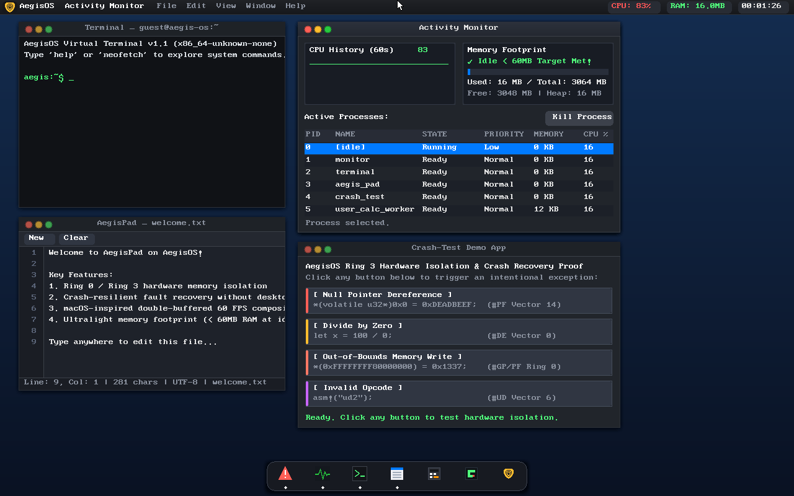

# Epsilon OS (AegisOS kernel)

A crash-resilient x86_64 operating system in `no_std` Rust, with hardware Ring 0/Ring 3
fault isolation and a double-buffered graphical desktop.

The kernel identifies itself as **AegisOS**; `epsilon-os` is the repository name.



## What it is

~16,500 lines of bare-metal Rust across 49 files: Limine boot into a higher-half
kernel, GDT/TSS/IDT, 4-level PML4 paging, a bitmap frame allocator and 16 MB kernel
heap, a 100 Hz preemptive round-robin scheduler, and a software compositor driving a
macOS-style desktop with fourteen applications. On top of that sits an in-memory VFS,
a PC-speaker audio stack, a virtual loopback IPv4/UDP network stack, and a serial
agent bridge.

The headline feature is fault isolation. A Ring 3 process that dereferences null,
divides by zero, executes `ud2`, or writes into kernel space is trapped by hardware,
logged, and reaped — the desktop keeps running:

```
[FAULT-ISOLATION] Userspace Fault caught: Page Fault (#PF) (vec 14) at RIP=0x400000, ErrorCode=0x6, CR2=0x0
[FAULT-ISOLATION] Process PID 9 ('crash_null_ptr') crashed due to Page Fault (#PF)
[FAULT-TELEMETRY] Ring 3 Task PID 9 caught Page Fault (#PF). Desktop remains 100% stable.
```

The Crash-Test app has a button for each of those four faults. They all work.

## Build and run

Needs a Rust toolchain with the `x86_64-unknown-none` target, plus `qemu-system-x86_64`
and `xorriso`.

```sh
rustup target add x86_64-unknown-none
./run_qemu.sh                 # builds the kernel, packages the ISO, boots it
./build_iso.sh                # just produce aegis_os.iso
```

Headless, with serial on stdout:

```sh
qemu-system-x86_64 -cdrom aegis_os.iso -m 4G -accel kvm -vga std \
                   -display none -serial stdio
```

The ISO is a build artifact and is not committed.

## Applications

Fourteen apps, all reachable from the dock (`AppId::ALL`, `src/gui/dock.rs`) and from
Spotlight:

| App | What it does |
|---|---|
| Terminal | Shell with 20+ commands, tab completion, history, ANSI colour |
| Activity Monitor | Live CPU/RAM graphs, process table with Kill |
| Crash-Test | One button per fault class (#PF null, #PF OOB, #DE, #UD) |
| AegisPad | Multi-tab editor: line numbers, find/replace, syntax highlighting |
| Aegis Files | Finder-style browser over the VFS, previews, opens into AegisPad |
| Aegis Browser | `aegis://` and `vfs://` protocols, markdown renderer, back/forward |
| Aegis Paint | 436x220 canvas, Bresenham strokes, 12 swatches, PPM export to VFS |
| AegisSynth | 2-octave piano roll + 4-track 16-step sequencer on the PC speaker |
| AegisChat | Multi-channel client over the loopback UDP stack, replies from the agent bridge |
| Minesweeper | 9x9 and 16x16, first-click safety, flood reveal |
| Snake | Retro arcade |
| Calculator | Scientific |
| System Settings | Appearance / Sound / Display panes, wallpaper picker |
| About | Kernel version, architecture, memory stats |

`run <app>` currently launches nine of them — `calc`, `snake`, `crashtest`, `monitor`,
`pad`, `about`, `paint`, `files`, `settings`. Browser, Minesweeper, Synth and Chat are
dock- and Spotlight-only.

Terminal commands: `help`, `neofetch`, `ps`, `kill`, `crash`, `calc`, `free`, `run`,
`history`, `echo`, `symbols`, `beep`, `play`, `wallpaper`, `ls`, `cat`, `write`,
`touch`, `mkdir`, `rm`, `df`, `sound`, `clear`, `reboot`. (`mkdir` works but is not
listed in `help` or offered by tab completion.)

## Subsystems beyond the desktop

- **VFS** (`src/fs/`) — in-memory RAM disk with hierarchical paths, inodes, seeded
  system docs, and full CRUD. Backs `ls`/`cat`/`write`, Aegis Files, AegisPad saves,
  and Paint's PPM export.
- **Audio** (`src/drivers/speaker.rs`) — PC speaker via PIT channel 2: tones, note
  sequences, sound effects, and the Synth's sequencer.
- **Network** (`src/net/`) — IPv4 framing (RFC 791), UDP datagrams (RFC 768), ones'
  complement internet checksum, and a virtual loopback device with a non-blocking
  `UdpSocket`. No physical NIC driver; loopback only.
- **Agent bridge** (`src/agent/`) — Ring 0 RPC over serial exposing telemetry, VFS
  operations, and process control. AegisChat's `#agent` channel talks to it.
- **Spotlight** (`src/gui/spotlight.rs`) — Ctrl+Space search across apps, VFS files,
  shell commands, and inline math.
- **Window snapping** (`src/gui/wm.rs`) — left-half, right-half, and maximize edge
  snapping with a live preview overlay.

## Measured state

Numbers from QEMU (`-accel kvm`, 1280x800x32) — serial logs, framebuffer screendumps
and `rdtsc`, not estimates.

| | |
|---|---|
| Compositor | paced to 60 FPS (`arch::FramePacer`, TSC-calibrated) |
| Uptime clock | accurate to wall time |
| Timer | 100 Hz (PIT-programmed) |
| Memory at idle | 16 MB of 3064 MB |
| Fault isolation | #PF, #DE, #UD and Ring 3 → kernel-space write all trapped and reaped |
| Stability | 560-event input flood + soak, interrupts stay enabled |

Resolution is not hardcoded; verified booting at both 1280x800 and 800x600.

Earlier revisions of this file quoted ~72 FPS and ~28 Mcyc per frame. Those were real
measurements of a free-running compositor, but the frame loop now calibrates the TSC
against the PIT and paces to a 16.667 ms budget, so 60 FPS is the ceiling by design.
The frame-cost figure predates the applications and subsystems above; HANDOFF.md notes
app rendering is now the largest share of it. Re-measure before quoting either.

## Tests

Two suites exercise the real kernel, and one older tree does not.

**`tests/qemu_e2e/` — the real one.** A Python harness that boots `aegis_os.iso` in
QEMU, drives it through the QEMU monitor (`sendkey`, mouse move/click), parses COM1
serial output, and captures framebuffer screendumps as PPM to assert on colour variety
and GUI chrome. It also reads `info registers` to check `RFLAGS.IF` stays set and `RIP`
keeps advancing under load. 22 test suites across 20 modules:

```sh
./run_e2e_tests.sh
```

**`src/selftest/` — in-kernel.** 14 bare-metal suites compiled in behind
`--features selftest`, run at early boot, exiting QEMU deterministically through
`isa-debug-exit` (0x21 pass / 0x23 fail). Covers the frame allocator, PML4 paging and
address-space isolation, the heap, scheduler lifecycle, VFS, speaker, PPM parser,
calculator, terminal, agent/Spotlight/browser, Minesweeper, editor, Synth, and the
network/chat path:

```sh
./run_selftest.sh
```

**`tests/e2e/` — design notes, not evidence.** ~6,700 lines of `std` Rust that model
the kernel's interfaces on the host and never reference the kernel crate. It once
reported "135/135 passed" while the kernel deadlocked on boot, which is exactly what a
suite that never links the kernel can do. Kept for the design record; the QEMU suite
above superseded it. TEST_READY.md §3 has the full story.

HANDOFF.md reports the QEMU suite at 22/22 in ~179s and the self-tests at 14/14 as of
the last milestone. Both are claims from that log, not from a run in this checkout —
run the scripts if you need current numbers.

## Reading order

- [`HANDOFF.md`](HANDOFF.md) — what was broken, what was fixed, and what to do next.
  Start here.
- [`PROJECT.md`](PROJECT.md) — architecture, feature inventory, and the two
  engineering invariants the kernel depends on.
- [`TEST_INFRA.md`](TEST_INFRA.md) — test framework and coverage matrix.
- `src/arch/mod.rs` and `src/drivers/ring.rs` — those two invariants in code.
